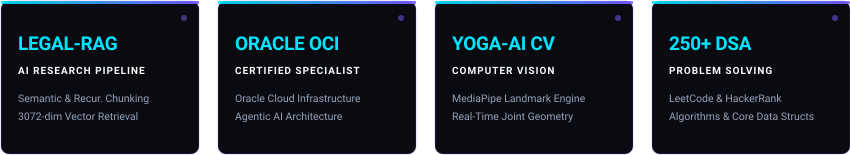

<p align="center">
  
</p>

<p align="center">
  
  
  
  
</p>

<br />

I architect high-throughput machine learning pipelines, domain-adapted Retrieval-Augmented Generation (RAG) architectures, and real-time computer vision engines. My technical research centers on statutory legal information retrieval over Indian legal corpora, comparative evaluation of chunking strategies, and quantized local LLM inference workflows. Currently completing my B.Tech in Artificial Intelligence & Machine Learning at PSIT Kanpur, I bring verified credentials in Oracle Cloud Infrastructure (OCI) & Agentic AI alongside extensive hands-on experience in full-stack AI system design.

<br />

<p align="center">
  
</p>

### TECHNICAL CAPABILITIES

<p align="center">
  <!-- Core Languages -->
  
  
  
  
  
  
  
  <br />
  <!-- AI, Deep Learning & GenAI -->
  
  
  
  
  
  
  
  
  <br />
  <!-- Computer Vision & Data -->
  
  
  
  
  
  <br />
  <!-- Backend, Cloud & Databases -->
  
  
  
  
  
  
  
  
  <br />
  <!-- DevOps, Systems & Tools -->
  
  
  
  
  
  
</p>

<br />

<p align="center">
  
</p>

### SELECTED ENGINEERING WORK

```
01 // NYAYABOT — INDIAN STATUTORY RAG INTELLIGENCE ENGINE
```
> **Domain-Adapted Legal NLP & Real-Time Statutory Retrieval System**  
> High-precision retrieval engine parsing Indian Penal Code (IPC), constitution provisions, and statutory rights. Built on an advanced RAG pipeline with comparative chunking evaluation (Fixed, Recursive, and Semantic chunking via `cl100k_base` encoding) indexed into a 3,072-dimensional vector space (`text-embedding-3-large`). Utilizes top-20 context retrieval with re-ranking to the top-5 candidate passages, batch-pipelining queries into local `LLaMA-3:8B` (Ollama) with deterministic sampling (temp 0.2) and full ROUGE-1/ROUGE-L/F1 evaluation.  
> **Tech Stack:** `Python` · `Flask` · `LangChain` · `RAG` · `LLaMA-3` · `Ollama` · `Firestore` · `Gemini API`  
> **Links:** [Repository](https://github.com/anuraggupta07122006/Legal-Chatbot) · [Research Notes](https://github.com/anuraggupta07122006/Legal-AI-Research)

<br />

```
02 // YOGA-AI — REAL-TIME BIOMECHANICAL POSE ANALYZER
```
> **Computer Vision Pose-Estimation & Kinematic Correction Engine**  
> Edge-compatible vision pipeline extracting 33 full-body 3D landmarks via MediaPipe and OpenCV. Computes real-time joint Euclidean vectors and angular trigonometry to evaluate posture correctness (asana alignment), delivering instant visual feedback and sub-50ms latency pose diagnostics.  
> **Tech Stack:** `Python` · `OpenCV` · `MediaPipe` · `NumPy` · `Computer Vision` · `Kinematics`  
> **Links:** [Repository](https://github.com/anuraggupta07122006/YOGA-Ai)

<br />

```
03 // ADAPTIVE LEARNING ENGINE — KNOWLEDGE GRAPH MASTERY
```
> **Personalized Educational Recommendation & Dynamic Difficulty System**  
> Intelligent learning orchestration framework that constructs dynamic student knowledge graphs. Models prerequisite dependencies, measures topic mastery curves, and delivers tailored algorithmic problem paths and contextual explanations to optimize long-term retention.  
> **Tech Stack:** `Python` · `Data Structures` · `Knowledge Graphs` · `ML Modeling` · `Adaptive Algorithms`  
> **Links:** [Repository](https://github.com/anuraggupta07122006/Adaptive-Learning-Engine)

<br />

```
04 // HACKINDIA 2025 — DATA DYNAMOS INTELLIGENCE PIPELINE
```
> **National Hackathon Engineering Solution**  
> Engineered machine learning prediction pipeline under competitive hackathon constraints, tackling complex structured data with robust feature engineering, exploratory data synthesis, and optimized ensemble classification models.  
> **Tech Stack:** `Python` · `Scikit-learn` · `Ensemble Methods` · `Feature Engineering` · `Pandas`  
> **Links:** [Repository](https://github.com/anuraggupta07122006/Data-Dynamos)

<br />

<p align="center">
  
</p>

### PROOF & CREDENTIALS

<p align="center">
  
</p>

#### Research & Technical Innovations
- **Indian Legal Corpus RAG Benchmarking:** Conducted systematic empirical evaluation of chunking strategies (*Fixed vs. Recursive vs. Semantic*) on a 1,000-document Indian statutory legal dataset. Benchmark metrics include Precision, Recall, F1, ROUGE-1, and ROUGE-L with statistical aggregations (mean, standard deviation, median) and radar chart visual mappings.
- **Local Low-Latency LLM Inference:** Built local batch-pipelined prompt interfaces integrating `LLaMA-3:8B` with strict context constraints (4,096 tokens, temperature 0.2) ensuring zero data leakage and predictable statutory guidance.

#### Industry Credentials & Honors
- **Oracle Certified — Cloud Infrastructure (OCI):** Validated competence in enterprise cloud deployment, compute architecture, VPC networking, and security governance.
- **Oracle Certified — Agentic AI Specialist:** Certified in designing autonomous multi-agent workflows, tool execution orchestration, and agentic cognitive loops.
- **Microsoft & LinkedIn — Generative AI:** Career Essentials in Generative AI credential holder.
- **CODSOFT — Web Development Intern:** Delivered responsive web applications and modular UI components during an intensive industry internship.

#### Algorithmic Problem Solving
- **250+ Verified DSA Problems:** Actively solved on [LeetCode](https://leetcode.com/u/anuragp2313001/) & [HackerRank](https://www.hackerrank.com/profile/AIML1_2313001), emphasizing dynamic programming, tree traversals, graph algorithms, and optimized memory complexity.

<br />

<p align="center">
  
</p>

### GITHUB METRICS & ACTIVITY

<div align="center">
  <!-- Streak Stats & Main Stats (Cyber-Obsidian Theme) -->
  <a href="https://github.com/anuraggupta07122006">
    
  </a>
  <a href="https://github.com/anuraggupta07122006">
    
  </a>
  <br /><br />
  <!-- Top Languages Donut -->
  <a href="https://github.com/anuraggupta07122006">
    
  </a>
  <br /><br />
  <!-- Contribution Grid Snake -->
  
</div>

<br />

<p align="center">
  
</p>

### QUICK CONNECT

```bash
anurag@quantum-terminal:~$ ./connect.sh --role "AI/ML Systems & SDE"
[✓] Status   : Available for high-impact internship & engineering roles
[✓] Base     : Kanpur, India (UTC +05:30)
[✓] Contact  : ag257725941@gmail.com
```

<p align="center">
  <a href="https://github.com/anuraggupta07122006"></a>
  <a href="https://www.linkedin.com/in/anurag-gupta-62282b317/"></a>
  <a href="https://leetcode.com/u/anuragp2313001/"></a>
  <a href="https://www.hackerrank.com/profile/AIML1_2313001"></a>
  <a href="mailto:ag257725941@gmail.com"></a>
</p>

<p align="center">
  <sub>Designed &amp; Engineered by <b>Anurag Gupta</b></sub>
</p>
